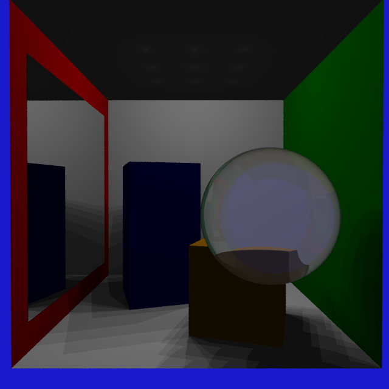

## Dependencies

### embree4

#### linux

pacman: `pacman -S embree`

apt: `apt install libembree-dev`

If you get `stddef.h` errors, try instaling clang

#### windows

Download the .zip, place the path to `embree/lib` in the LIB environment variable and `embree/bin` in the PATH

If needed see [Embree GitHub page](https://github.com/embree/embree) or [Embree website](https://www.embree.org/).

## Running

```bash
cargo run
```

